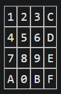
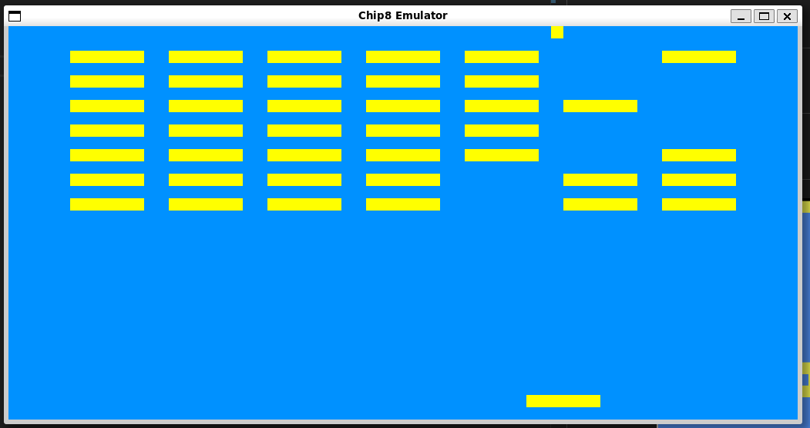
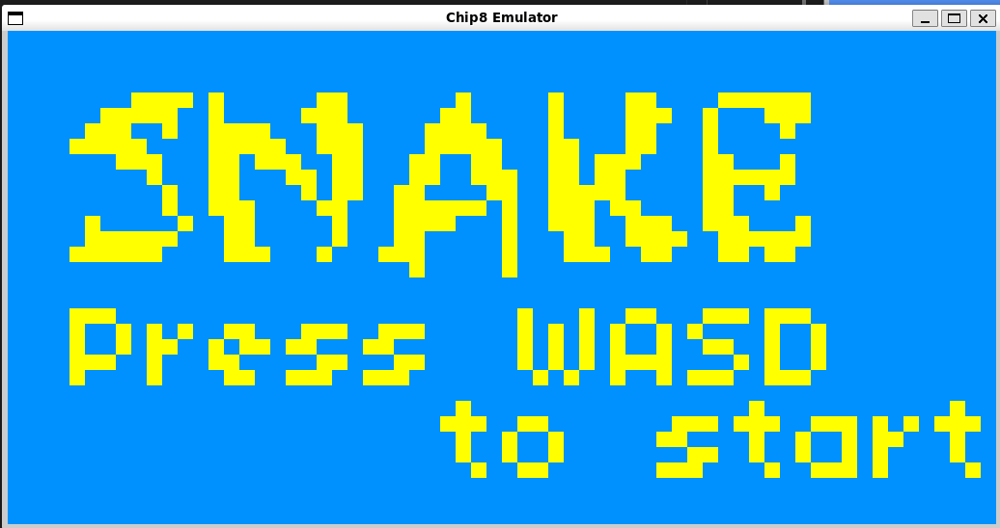
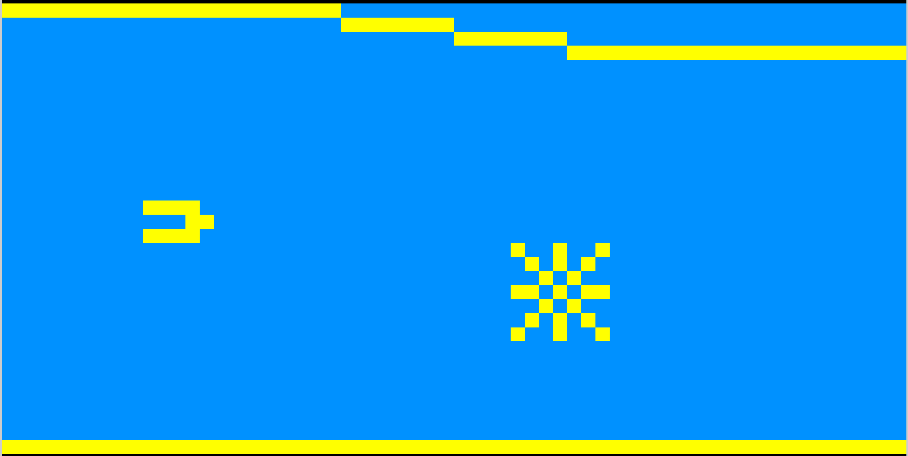

# Chip 8 Emulator
This project is an implementation of a chip 8 emulator. The code parses binary roms and runs the instructions on the software chip 8 cpu.
Huge shout out to [Cowgods Guide](http://devernay.free.fr/hacks/chip8/C8TECH10.HTM) and [Timendus Test Suite](https://github.com/Timendus/chip8-test-suite) for tests.

# Run
```
make
./a.out <rom/path>
```
## Keybindings


|| chip_key - keyboard ||

```
|| 1 - 1 || 2 - 2 || 3 - 3 || C - 4 ||
|| 4 - Q || 5 - W || 6 - E || D - R ||
|| 7 - A || 8 - S || 9 - D || E - F ||
|| A - Z || 0 - X || B - C || F - V ||
```

# Examples

## Breakout


## Snake


## SpaceJam


